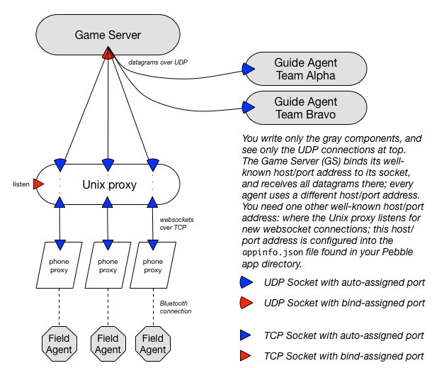

CS50 Project: Key Assembly

## Project: Getting Started

Recall from the Key Assembly project overview page, 

> One person on your team should fork the `project-starter-kit-17s` Gitlab project, rename the project with your team’s assigned name, edit the project description to list team members, then invite your teammates to share the project. All team members should clone the project to a local repository.

To get started, *one* project team member should

* click the "Fork" button above; this should create a copy of this project in your Gitlab account.
* ensure that your new project is marked PRIVATE.
* grant "Master" access to your new project to `cs50-17s`.
* copy the **https** URL shown in the box in the middle of the screen.
* go to your terminal (locally and/or one of the CS50 Unix hosts).
* `mkdir -p cs50/project; cd cs50/project`
* git clone `URL` #<<<paste the URL you copied above here
* explore the provided files (see: [Overview of Provided Code](overview-of-provided-code), and start building the *Key Assembly* project! Good luck!

See the official project files on our website for more information:

* [Final Project Logistics](http://www.cs.dartmouth.edu/~cs50/Labs/Project/)
* [Key Assembly Requirements](http://www.cs.dartmouth.edu/~cs50/Labs/Project/REQUIREMENTS.html)
* [Pebble Information](http://www.cs.dartmouth.edu/~cs50/Labs/Project/pebble.html) (and a helpful [diagram](http://www.cs.dartmouth.edu/~cs50/Labs/Project/imgs/MI-network.png))

### Update the top-level `README`

After you've completed the above steps, you should modify the `README` (the top-level `README` for your entire project) with information that includes, but certainly is not limited to,

* your team's name,
* names of all of the members in your team,
* brief description about each of the directories and significant files in the top-level directory,
* instructions on how to configure, compile, and run your project.
* delete the information on forking and creating a new project

## Overview of Provided Code

In this section we provide a brief overview of the provided code. You'll see that the directory structure that we have given you as a starting point is designed to keep each major component in this project separate and encourage modular design. Please build each component in the respective directory. Feel free to add other folders as needed (e.g., `libs/`, `common/`, `build/`).

```
$ tree .
.
|-- GETTING-STARTED.md           <<< README! ***please don't modify - you fill in README.md***
|-- Makefile                     <<< top-level Makefile (see: start-proxy/stop-proxy)
|-- README.md
|-- docs                         <<< placeholders...
|   |-- DESIGN.md
|   |-- IMPLEMENTATION.md
|   |-- KA-network.png
|   `-- TESTING.md
|-- examples                     <<< provided examples ***please don't modify***
|   `-- appinfo.json
|-- field-agent                  <<< minimal base for field agent (customized build script, app.js phone proxy)
|   |-- Makefile
|   |-- appinfo.json
|   |-- src
|   |   |-- Makefile
|   |   |-- field-agent.c
|   |   |-- js
|   |   |   |-- app.js
|   |   `-- mission.h             <<< official cs50 header ***please don't modify***
|   `-- wscript
|-- game-server                   <<< placeholder...
|   `-- Makefile
|-- guide-agent                   <<< placeholder...
|   `-- Makefile
`-- proxy                         <<< unix proxy ***please don't modify***
    |-- package.json
    `-- proxy
```

> All files marked `***please don't modify***` really should not be edited. We may make updates available to some of these files and if you modify them you will likely have to resolve "merge conflicts" (i.e., discrepencies between your code and our code). This may prevent you from being able to get updates! 

* `GETTING-STARTED.md` (this file): information about the project starter-kit.

* `Makefile`: a top-level Makefile with a few PHONY targets defined that will make it easy for you to (1) install any proxy dependencies, (2) start an instance of the proxy, and (3) kill a running proxy. Please update and modify the `Makefile` file as you see fit for your project development.

* `examples/appinfo.json`: You must create a file `field-agent/appinfo.json` that holds special configurations for your Pebble application. The Pebble SDK will consult that file to determine how to properly build your Pebble application. For this project, the `appinfo` includes fields for specifying the address (IP and Port) of the Proxy and Game Servers. The file `examples/appinfo.json` is an *example* you can copy when making your file `field-agent/appinfo.json`; do not modify the example file. If we release updates to `examples/appinfo.json` you'll want update or replace your existing `field-agent/appinfo.json`.

* `field-agent/`: A starting point for your Pebble app, including
    * `appinfo.json`: primary configuration file!  Edit it to specify YOUR host/port config. 
    * `wscript`: slightly customized version of the pebble application build script (exports `appinfo.json` as variable to phone proxy code base).
    * `src/field_agent.c`: main file for your pebble application.
    * `src/key_assembly.h`: important definitions needed for communications with the phone proxy.  ***please don't modify!***
    * `src/js/app.js`: the phone proxy. ***please don't modify!***

* `proxy/`: The Unix Proxy that sits between the Game Server and your Field Agents. 
    * In the top-level `Makefile`, examine the `start-proxy` and `stop-proxy` for controlling your proxy process.
    * `package.json` information about dependencies for the proxy code. 
    * **NOTE:** `Node.js` and `NPM` are all installed on the CS Linux servers -- when in doubt, run your Proxy and Game Server on one of the CS Linux servers. You can install `Node.js/NPM` on OS X with [homebrew]({{site.resources}}/Homebrew.html). Once installed, you can download the WebSocket dependency simply by running `make install-proxy-deps`.  


## Field Agent/Game Server/Guide Agent Communication

In this section we hope to clarify a few matters regarding how the various components in this project communicate.

#### Proxies Explained

It is essential that you and your team have a good understanding of how all of the Key Assembly components work together. The diagram below shows the following:

* You are only responsible for building the Field Agent, Guide Agent, and Game Server components -- the Unix and smartphone proxy components are provided.
* There is a 1-to-1 mapping between Field Agents and phone proxies. Each Field Agent (Pebble) is paired with a companion smartphone that enables the Field Agent to deliver messages to the Game Server over the Internet. The phone proxy's primary role is to run indefinitely, sending messages from the Field Agent to the Game Server (via the Unix Proxy) and vice versa.
* Field Agents, by virtue of their relationship with the phone proxy, can't communicate directly with other Field Agents. Field Agents can only communicate with the Game Server through the phone proxy and the Unix proxy.  The phone proxy must know the address (IP and port) of the Unix proxy and the Game Server, in advance, which is why that address is configured in `appinfo.json`. Guide Agents are able to communicate directly over UDP with the Game Server; they must be given the address (IP and port) of the Game Server. 
* There is a 1-to-1 mapping between a Unix proxy and Game Server. In orther words, all Field Agents in a given game communicate (via their phone proxy) with the Game Server via one, and only one, Unix proxy. All Field Agent communications with the Unix Proxy are over a reliable WebSocket (TCP) connection (because phone proxies are able to create WebSockets but are unable to create UDP sockets). The Unix proxy, able to create UDP sockets, creates a new UDP socket for each player (to receive datagrams back from the Game Server) and sends all of its "traffic" to the pre-defined UDP address on the Game Server. Thus, although there is only one Unix proxy, each Field Agent appears to the Game Server as being at a distinct address. 
    * Digging Deeper (for those interested): Every phone proxy that connects to the Unix proxy has a single, reliable connection for communication. As part of handling the new connection, the Unix proxy creates a new UDP socket for sending/receiving datagrams to/from that websocket connection. This means that every Field Agent connected to the Unix proxy gets a unique UDP socket which makes the player appear as if it is communicating with the Game Server via UDP all by itself/directly! This is why, as the builder of the Game Server, you need only worry about handling datagrams received over a single UDP socket - just pay attention to the address (IP/port) from whence those datagrams arrive. 
* Your Game Server is responsible for managing information about the various clients that are actively involved in game play. I like to think of my Game Server representing each agent with a sort of tuple consisting of `<remoteAddress, remotePort, agentId>` where `agentId` can be a unique identifier for either a Field Agent (`pebbleId`) or Guide Agent (`guideId`). (In reality my "mental tuple" is a `struct` with the aforementioned information plus more). Our ability to uniquely identify any given player is entirely dependent on the unique ID. To communicate back to specific players we can identify them by their unique ID and then use their remote address/port information to send datagrams.

<!--center tag not supported in html5?-->
<center> 

</center>

***=>*** *In summary: your Game Server needs to (1) open a single UDP socket which it will read from, and (2) keep track of the remote client's address (IP/port) for all known agents (both Guide Agents and Field Agents).* 


#### Field Agent: Communicating over Bluetooth

The Pebble has no Wi-Fi interface and cannot connect directly to the Internet. To reach the Internet, it must send messages through some companion device (e.g., your smartphone) over Bluetooth, and then messages can be sent to the Game Server over your companion device's Wi-Fi or Cellular connection to the Internet. To use Bluetooth, you'll need to use Pebble's `AppMessage` API.

> AppMessage is a bi-directional messaging subsystem that enables communication between phone apps and Pebble watchapps. This is accomplished by allowing phone and watchapps to exchange arbitrary sets of key/value pairs. The key/value pairs are stored in the form of a Dictionary, the layout of which is left for the application developer to define.

> AppMessage implements a push-oriented messaging protocol, enabling your app to call functions and methods to push messages from Pebble to phone and vice versa. The protocol is symmetric: both Pebble and the phone can send messages. All messages are acknowledged. In this context, there is no client-server model, as such.

> During the sending phase, one side initiates the communication by transferring a dictionary over the air. The other side then receives this message and is given an opportunity to perform actions on that data. As soon as possible, the other side is expected to reply to the message with a simple acknowledgment that the message was received successfully.

> PebbleKit JavaScript provides you with a set of standard JavaScript APIs that let your app receive messages from the watch, make HTTP requests, and send new messages to the watch. AppMessage APIs are used to send and receive data. A Pebble watchapp can use the resources of the connected phone to fetch information from web services, send information to web APIs, or store login credentials. On the JavaScript side, you communicate with Pebble via a Pebble object exposed in the namespace.

> Messages always need to get either ACKnowledged or "NACK'ed," that is, not acknowledged. If not, messages will result in a time-out failure. The AppMessage subsystem takes care of this implicitly. In the phone libraries, this step is a bit more explicit.

> The Pebble watch interfaces make a distinction between the Inbox and the Outbox calls. The Inbox receives messages from the phone on the watch; the Outbox sends messages from the watch to the phone. These two buffers can be managed separately.

> -- from Pebble's official documentation on the [AppMessage subsystem](https://developer.pebble.com/docs/c/Foundation/AppMessage/).

To communicate over Bluetooth you'll have to define 4 functions that do the work of preparing messages to be sent and parsing messages upon receiving them, and then register those functions as callbacks with Pebble's `AppMessage` subsystem (Bluetooth). 


```c
// Register Bluetooth communication callbacks
app_message_register_inbox_received(inbox_received_handler);
app_message_register_inbox_dropped(inbox_dropped_callback);
app_message_register_outbox_failed(outbox_failed_callback);
app_message_register_outbox_sent(outbox_sent_callback);

// Open `AppMessage` - to always get the largest buffer available, follow this best practice:
app_message_open(app_message_inbox_size_maximum(), app_message_outbox_size_maximum());
```

Notice that Pebble uses the notion of "inboxes" and "outboxes" to denote where messages are kept upon receiving them, and where messages are put when you want to inform the system you are ready to send a message, respectively.  When we open the `AppMessage` subsystem, we request the maximum-sized boxes, because the Mission Incomputable protocol requires fairly lengthly messages. 

After setting up your inbox and outbox for Bluetooth communications, you can access messages when they arrive at your Pebble.  For example, one of the (many) communications your Pebble app will receive corresponds to `AppKeyJSReady` (indicating that the JavaScript (JS) environment is ready and running on your smartphone, and is ready to communicate with your Pebble). 

```c
// This is my callback that I registered above (i.e., called when a new message arrives over Bluetooth)
static void inbox_received_handler(DictionaryIterator *iterator, void *context) {
    // Check: Is this a PebbleKit JS ready message?! If so, then it is safe to send messages!
    Tuple *ready_tuple = dict_find(iterator, AppKeyJSReady);
    if(ready_tuple) {
        // Log the value sent as part of the received message.
        char *ready_str = ready_tuple->value->cstring;
        APP_LOG(APP_LOG_LEVEL_DEBUG, "Got AppKeyJSReady: %s", ready_str);
    }
    
    // ...other "checks"...
}
```

All data between your Pebble and smartphone is stored in a *dictionary* ([`DictionaryIterator`](https://developer.pebble.com/docs/c/Foundation/Dictionary/#DictionaryIterator)), making it possible for your Pebble code to receive data from the smartphone by looking up a predefined key (`AppKeyJSReady`) in the dictionary and processing the data (value) returned. The `dict_find(...)` routine will return `NULL` if the key is not found in `iterator`.

The companion smartphone will send many other kinds of messages; in `key_assembly.h` we provide only the keys you should need.

```c
// see: key_assembly.h -- AppMessage keys (***DO NOT MODIFY***)
enum {
  AppKeyJSReady = 0,      // The JS environment on the companion smartphone is up and running!
  AppKeySendMsg,          // Send a message over Bluetooth to the companion smartphone and then on to the Game Server
  AppKeyRecvMsg,          // A message from the Game Server is available (arrived over Bluetooth)
  AppKeyLocation,         // Request your GPS location from the companion smartphone
  AppKeyPebbleId,         // Request your unique pebble ID from the companion smartphone
  AppKeySendError         // Error: companion app can't connect to the Proxy (and ultimately the Game Server).
};
```

Some of these keys are for receiving information from the smartphone, some are for sending information to the smartphone (and thents to the Game Server), and some are for both sending and receiving, as follows.

* `{AppKeyJSReady : PEBBLE-ID}` - sent from the smartphone to the pebble; for convenience, the "value" contains the Pebble ID that players must send to the Game Server as part of their well-formatted messages.
* `{AppKeySendMsg : FORMATTED-GAME-MSG}` - sent from the pebble to the smartphone to ask it to send the "value", a formatted string, to the Game Server. 
* `{AppKeyRecvMsg : FORMATTED-GAME-MSG}` - sent from the smartphone to the pebble to inform the pebble that a message from the Game Server has arrived. The "value" is a well-formatted string.
* `{AppKeyLocation : IGNORED/LOCATION-STR}` - when sent from the pebble to the smartphone, the smartphone interprets this as a request to get the current location of the user; the "value" is ignored so it can be anything. When sent from the smartphone to the pebble, the pebble interprets this as a response to a previous location request it made and stores the "value" (a string with latitude and longitude separated by a vertical bar (`|`)) as its last known location. 
* `{AppKeyPebbleId : IGNORED/PEBBLE-ID}` - when sent from the pebble to the smartphone, the smartphone interprets this as an explicit request to get the Pebble ID; the "value" is ignored so it can be anything. When sent from the smartphone to the pebble, the pebble interprets this as a response to a previous request it made to get the Pebble ID and stores the "value" (a string with the Pebble ID). 
* `{AppKeySendError : DETAILED-ERROR-MSG}` - sent from the smartphone to the pebble to inform the pebble that it, as the phone proxy, is unable to connect via a WebSocket to the Unix proxy.

Now that you know how to check to see if some *received* messsage corresponds to a particular type of messsage, and you know all of the defined keys that exist for communication between your Pebble and a companion device, the last relevant bit of information is how to *send* data to the companion over Bluetooth. One thing that you will want to do periodically in your Pebble application is request your current location. The Pebble doesn't have GPS but your smartphone does and the companion app knows how to query your smartphone services for your current GPS data. 

```c
// Request location
sendInt(AppKeyLocation, 1);
```

where

```c
/*
 * Send a message (int) to the smartphone over Bluetooth. 
 * (if the JS environment is ready). 
 */
static void sendInt(int key, int value) {
    // Declare the dictionary's iterator
    DictionaryIterator *iter;

    // Prepare the outbox buffer for this message
    AppMessageResult result = app_message_outbox_begin(&iter);

    if(result == APP_MSG_OK) {
      // Construct & send the message.
      dict_write_int(iter, key, &value, sizeof(int), true);
      result = app_message_outbox_send();
      if(result != APP_MSG_OK) {
        // handle error!
      }
    } else {
        // handle error!
    }
}
```
It is worth noting in this case that the smartphone doesn't care what *value* you send it as part of the key/value pair data---the smartphone will try to get location data and send it back to you anytime you send it a message keyed with `AppKeyLocation` regardless of the value.

I've also only showed you how to send messages with `int` values; as you might imagine you might find it useful to create other versions of such a routine for handling sending messages where the value can be a different type (e.g., strings). 

**IMPORTANT NOTE:** *I haven't included the source code in the `sendInt()` routine to address some issues that are definitely worth considering -- such as checking that the JS environment on the smartphone is up and running before you try to send it messages, and handling the error cases that I allude to in the example code above. You should spend some time thinking about how your Pebble application can best handle these issues.*

#### Suggested Resources - Bluetooth Communications

It is our goal to provide some ideas on how to get going with the project here, but this is in no way a comprehensive guide for all that you need to know in order to implement the project. For more information on Pebble APIs and services provided on the Pebble platform, as well as more examples around how Bluetooth communications work on the Pebble, see Pebble's official documentation for [`AppMessage`](https://developer.pebble.com/docs/c/Foundation/AppMessage/) as well as the Pebble guides on [Advanced Communication](https://developer.pebble.com/guides/communication/advanced-communication/) and [Sending and Receiving Data](https://developer.pebble.com/guides/communication/sending-and-receiving-data/). You may also find the [`TickTimerService`](https://developer.pebble.com/docs/c/Foundation/Event_Service/TickTimerService/) and [`ConnectionService`](https://developer.pebble.com/docs/c/Foundation/Event_Service/ConnectionService/) documentation useful. 

## Getting Future Updates for Provided Code

> *Please inform Taylor Hardin & Professor David Kotz if you find bugs in the provided code, using Piazza. If you find a bug in the provided code, everyone else has this problem and we will want to release a fix via the upstream repository for everyone to pull.* 

We may need to update some of the code that we've provided (e.g., bug-fixes) for this project.  To ensure that you can get updates, you'll need to add the original repo as a *remote* in your local copy of this project. 

You can view the current configured remotes as follows (example output shown):

```bash
$ git remote -v
origin	https://gitlab.cs.dartmouth.edu/USERNAME/project-starter-kit-17s.git (fetch)
origin	https://gitlab.cs.dartmouth.edu/USERNAME/project-starter-kit-17s.git (push)
```

where `USERNAME` is the username of the GitLab user that forked the project starter-kit. When you run git commands such as `git pull` and `git push`, the git command-line tool uses these URLs to determine from where to pull code and where to push code. Notice that, after `fork`ing the project, your default remote is a copy of the starter-kit for the project in `USERNAME`'s GitLab account.

To add the *original* repo to the remotes that you are tracking, use the `git remote add` command:

```bash
$ git remote add upstream https://gitlab.cs.dartmouth.edu/CS50/project-starter-kit-17s.git
```

where `upstream` is a human readable alias for the new remote you are adding, where `CS50` is the original owner of the repo which you `fork`ed, and `project-starter-kit-17s.git` is the original name of the repository which you `fork`ed.

You can verify that the remote was added by again running `git remote -v`. For example:

```bash
$ git remote -v
origin	https://gitlab.cs.dartmouth.edu/USERNAME/project-starter-kit-17s.git (fetch)
origin	https://gitlab.cs.dartmouth.edu/USERNAME/project-starter-kit-17s.git (push)
upstream	https://gitlab.cs.dartmouth.edu/CS50/project-starter-kit-17s.git (fetch)
upstream	https://gitlab.cs.dartmouth.edu/CS50/project-starter-kit-17s.git (push)
```

Suppose you post a message about updating the provided code.
**First**, commit and push all of your changes to your own repository.
**Then**, you can `pull` the changes into your code:

```bash
$ git pull upstream master
```

where `upstream` is the alias for the remote you created above and `master` indicates the branch that you'd like to pull from (we will keep all updates on the `master` branch). 
